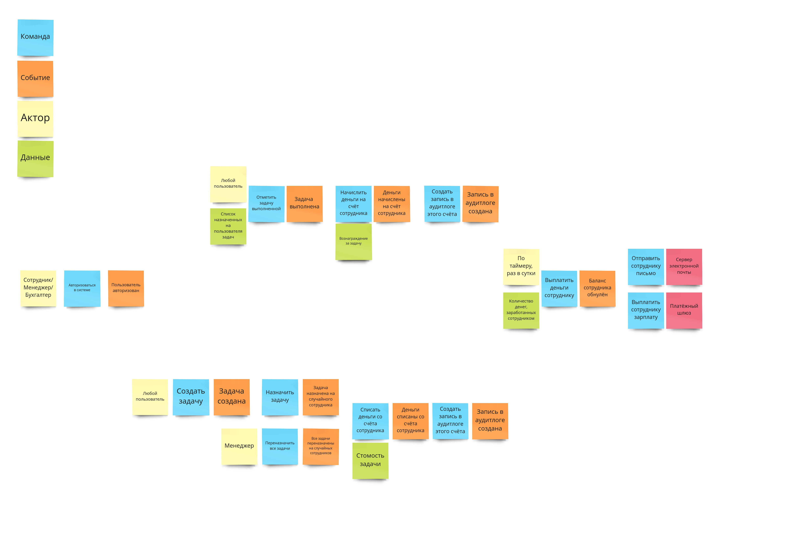
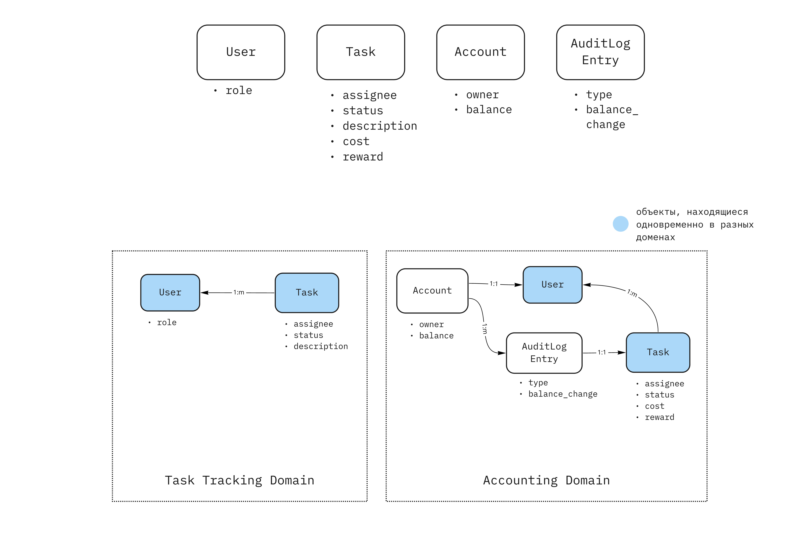
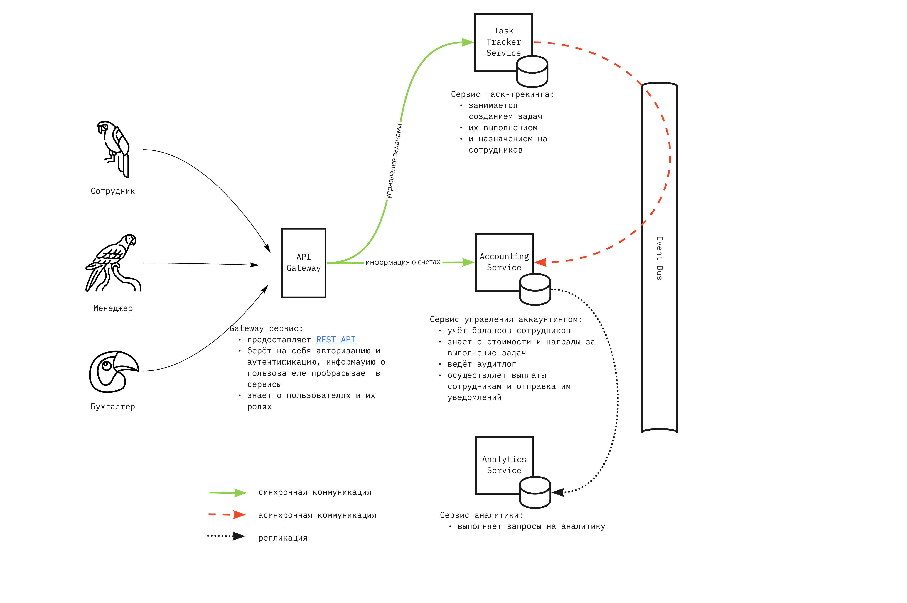

# Проектирование системы

## Event Storming

[Доска в Miro](https://miro.com/app/board/uXjVPSIgm60=/?moveToWidget=3458764534895170411&cot=14)

В результате ES выделены следующие цепочки бизнес-событий:

1. **Авторизация пользователя**. Любой из сотрудников авторизуется в системе и работает под своей учётной записью
2. **Создание задачи** и **Переназначение исполнителей**. Первая опервация приводит к появлению новой задачи, назначенной на сотрудника. Вторая — к переназначению всех открытых задач на новых сотрудников. Каждая из этих бизнес-операций приводит к событию списания денег со счёта сотрудника, на которого назначена задача и фиксации этой операции в аудитлоге.
3. **Выполнение задачи**. Любой сотрудник может отметить свою задачу как выполненную, это приводит к начислению денег на баланс сотрудника и фиксации события в аудитлоге.
4. **Выплата денег сотруднику**. Производится по таймеру, количество денег, заработанных сотрудником выплачивается ему через платёжный шлюз, его счёт обнуляется, сотруднику отправляется электронное письмо. В результате операции счёт сотрудника обнуляется.

## Data Modeling

[Доска в Miro](https://miro.com/app/board/uXjVPSIgm60=/?moveToWidget=3458764534896149238&cot=14)

Сущности, выделенные в процессе Data Modeling:
- **Employee** — моделирует сотрудника, пользующегося системой. Сотрудники отличаются ролями: обычный сотрудник, менеджер, бухгалтер
- **Task** — моделирует задачу, заведённую в системе. Характеризуется статусом, описанием, сотрудником, на которого она назначена, стоимостью и величиной вознаграждения за выполнение.
- **Account** — счёт сотрудника, на который зачисляется и списываются оплата за назначенные и выполненные задачи.
- **AuditLog Entry** — запись в аудитлоге. Создаётся всякий раз, когда меняется баланс счёта сотрудника. Описывается типом и величиной изменения.

### Домены

Я выделяю два домена: **Task Tracking Domain** и **Accounting Domain**. Выделять аналитику в отдельный домен посчитал нецелесообразным, так как на этапе Event Storming не было выделено ни одной бизнес цепочки связанной с аналитикой. Аналитику можно будет построить используя сущности Accounting Domain, реплицируя данные из Accounting Domain.

В результате такого разделения, видно что сущности **Employee** и **Task** являются общими для разных доменов. Поэтому каждый будет содержать некое представление этой сущности в своей предметной области.

## Сервисы и связи

[Доска в Miro](https://miro.com/app/board/uXjVPSIgm60=/?moveToWidget=3458764534913638584&cot=14)

1. **API Gateway** — предоставляет [REST API](./openapi-spec.yaml), берёт на себя авторизацию и аутентификацию, знает о пользователях и их ролях.
2. **Task Tracker Service** — управление задачами: создание, закрытие, назначение исполнителей.
3. **Accounting Service** — учёт и управление счетами пользователей. Задаёт и хранит стоимости и вознаграждение задач, ведёт аудитлог операций со счётом. Занимается выплатой денег сотрудниками и отправкой уведомлений.
4. **Analytics Service** — запросы на получения аналитических данных.

### Синхронные связи

**API Gateway** и все остальные сервисы, взаимодействие по RPC.

### Асинхронные связи

**Task Tracker Service** и **Accounting Service**, путём отправки и обработки бизнес-событий. 

**Accounting Service** и **Analytics Service** — репликация данных.

## События

Бизнес-события:
- Назначение задачи на исполнителя, Task Tracker -> Accounting
- Выполнение задачи, Task Tracker -> Accounting

CUD-события:
- Создание задачи, Task Tracker -> Accounting. Данные которые нужны: id, assignee
- Изменение статуса задачи, Task Tracker -> Accounting. Данные, которые нужны: id, status
- Репликацию данны из Accounting в Analytics тоже можно считать CUD событиями, но представленными на низком уровне в виде репликации БД.