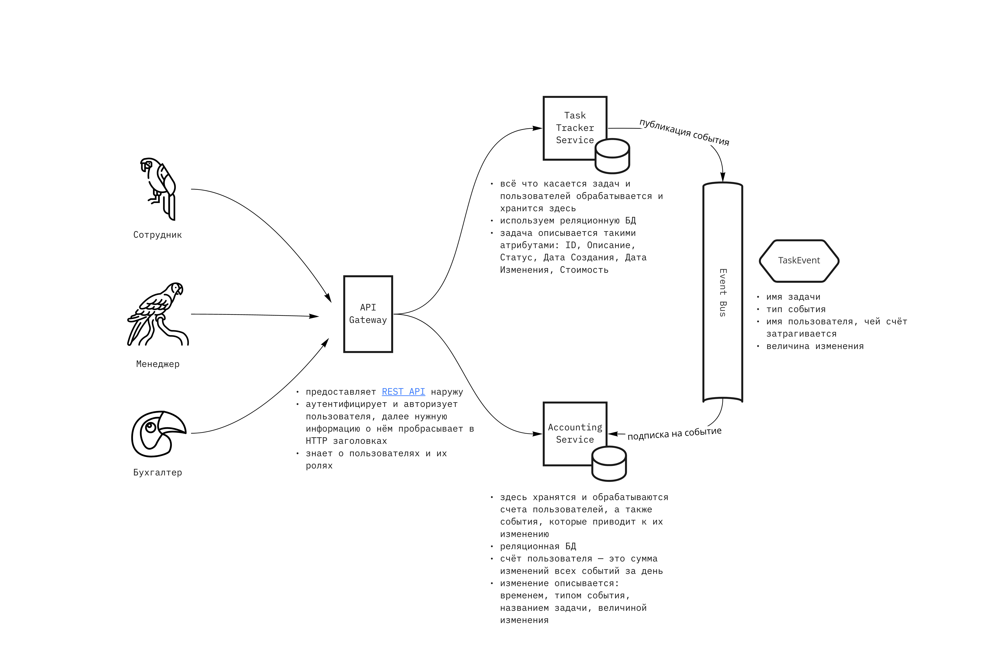

# Архитектура системы

Система представляет из себя набор backend сервисов, предоставляющих наружу REST API. Поверх этого API может быть построено любое клиентское приложение. Его разработка остаётся за скобками проекта.

## API Gateway

API Gateway является точкой входа внешних клиентов в сервисы. Выполняет несколько функций:
- занимается авторизацией и аутентификацией клиентов, в остальные сервисы информация о пользователе пробрасывается в виде HTTP заголовков
- знает о том, какие пользователи в каких группах находятся

[OpenAPI Spec](https://app.swaggerhub.com/apis/qwerty1337/ates-api/1.0.0)

**/v1/tasks** — для управления задачами
**/v1/accounts** — для отображения собственных счетов сотрудников и данных о заработке топ-менеджеров для бухгалтеров

Для отображения окна аналитики необходимо использовать данные, которое возвращают эндпоинты /v1/tasks/stats и v1/accounts/

